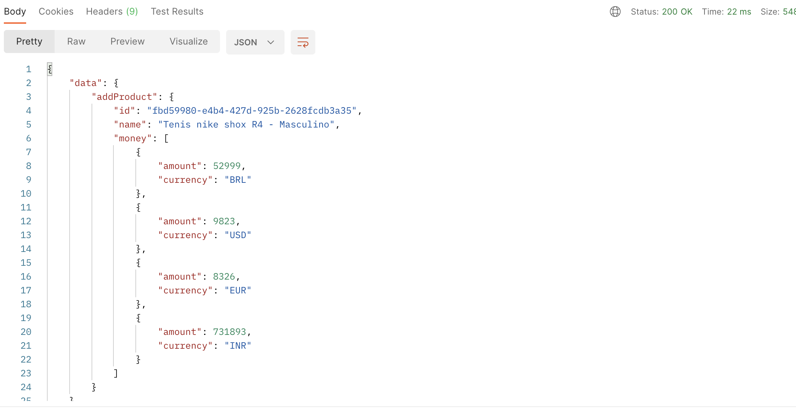

# Getting started

Olá, pessoal! Espero que todos estejam bem! =)

Gostaria de agradecer a oportunidade de realizar o teste e detalhar um pouco do que foi feito!

Dado o requisito de multiplos clients que iriam consumir nossa api, resolvi utilizar graphql para que cada client possa criar a query e assim
deixar mais fácil e performático.

Tentei manter uma arquitetura limpa e que facilitasse as futura alterações como o requisito, mantive as entitades e repositórios na camada
de domain, essa camada não depende de nenhuma outra e as que necessitam acessam ela.
Optei por salvar os valores dos produtos como um int, então, os valores dos produtos precisam ser enviados como int.

Para criar um produto, primeiro, precisamos criar as moedas(currency) e uma cotação(quote) para essa moeda.

Para facilitar e economizar tempo, subi dois bancos no docker compose, um especifico para os testes e outro para aplicação em si, devido ao tempo, não consegui adicionar migrations e um seed inicial da base.. sei que não é uma boa deixar essa sincronia ligada mas decidi por economizar tempo.

Para rodar o projeto, testes, é necessário ter o node, npm, docker e docker compose instalados

## Para rodar localmente em modo dev

```
    - git clone https://github.com/augustozanetti/eng-gruposbf-backend-javascript.git
    - npm run start:infra
    - npm install
    - npm run start:dev
```

## Para rodar localmente com o projeto ja feito o build

```
    - npm run start:infra
    - npm install
    - npm run start
```

Para testar, disponibilizei uma collection do postman que pode ser usada, já está configurada para inserir dados das moedas que atendemos, só executar ela primeiro

## Criação dos dados atráves da mutation

```
    - rodar atráves do postman a mutation `addCurrency`
    - rodar atráves do postman a mutation `addQuote`
    - rodar atráves do postman a mutation `addProduct`
    - para listar todos os produtos e suas moedas rodar a query de `products`
    - no campo money podemos listar por moedas especificas ["BRL", "USD"] ou deixar nulo e listar todas moedas disponíveis

```

## Tests

```
    - npm run test
```





